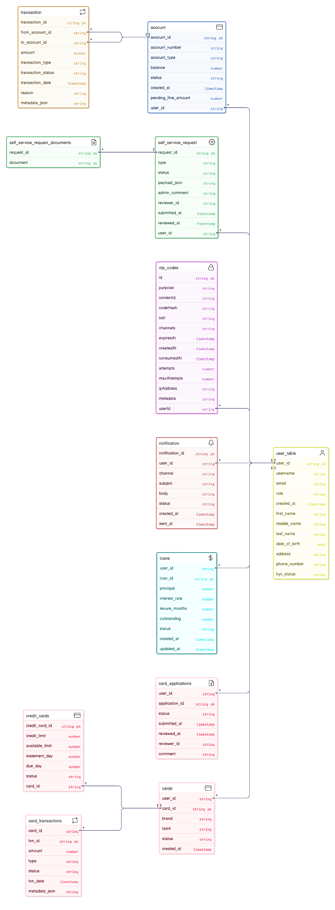

<!-- PROJECT TITLE & SHIELDS -->
<h1 align="center">🚀 Spring Banking Project – Microservices Architecture</h1>
<p align="center">
  
  
  
  
  
  
</p>
<p align="center">
  
  
  
  
</p>

<p align="center"><b>✨ Feature-rich Banking System built with cloud-native Java, modern Angular, Kafka, Keycloak, Spring Boot and OracleDB. Configurable, extensible, secure and ready for the enterprise!</b></p>

---

## 📖 Overview

**Multi-Module Microservice Project for Modern Banking:**
- Secure, modular, scalable 🏦
- JWT/OAuth2 Auth, central config, flexible deployment
- Interactive Angular Customer/Admin dashboards
- Realistic Oracle schemas & event-driven with Kafka
- <span style="background:yellow">*Paste YouTube link here (Demo Coming Soon!)* 🎬</span>

---

## 🗺 Project Architecture

<div align="center">
  
  <br/>
  <i>System Architecture: Service Communication, Core Techs, and Data Flows</i>
</div>

---

## 🗃 Database Schema

<div align="center">
  
  <br/>
  <i>Microservice-specific Oracle schemas & relationships</i>
</div>

---

## 🛠️ Tech Stack

|     |     |
| --- | --- |
|  **Java 17**             |  **Angular 16** |
|  **Spring Boot 3**      |  **OracleDB 19c**     |
|  **Keycloak 26**  |  **Kafka 2.8**    |
|  **Maven**                |  **Git/GitHub**                    |

---

## ⚡ Prerequisites

- Java 17 JDK in PATH
- Node.js 20.x & npm
- Oracle DB (localhost:1521/ORCL)
- Apache Kafka & ZooKeeper (2.8.0)
- Keycloak 26.3.5 (`http://localhost:8080`)
- Free ports: 8761, 8888, 9010/9011, 4200, 4300, microservice ports below

---

## 🔑 Ports & Services

| Service                    | Port    | Credentials (Oracle schema:password) |
|----------------------------|---------|-------------------------------|
| Keycloak (IAM)             | 8080    |  |
| Config Server              | 8888    |  |
| Eureka Service Registry    | 8761    |  |
| API Gateway                | 9010/1  |  |
| UserMicroservice           | 8000    | AUTH_MS/auth123          |
| TransactionService         | 8001    | TRANSACT_MS/transact123  |
| AccountMicroservice        | 8003    | ACCOUNT_MS/account123    |
| LoanMicroservice           | 8004    | LOAN_MS/loan123          |
| CreditCardService          | 8005    | CARD_MS/card123          |
| NotificationService (opt)  | -       | NOTIFY_MS/notify123      |
| banking-frontend           | 4200    |  |
| banking-admin-dashboard    | 4300    |  |

---

## 📁 Repo Layout

<details>
<summary>Click to Expand!</summary>

```
bank-config-repo/            # Centralized Spring Cloud config
Banking-Project-Microservice/
  ├─ api-gateway/
  ├─ config-server/
  ├─ local-eureka/          # Standalone Eureka (local use)
  ├─ UserMicroservice/
  ├─ AccountMicroservice/
  ├─ TransactionService/
  ├─ loan-service/
  ├─ CreditCardService/
  ├─ NotificationService/   # Enable later w/ mail & Kafka
  ├─ Angular Frontend/
      ├─ banking-frontend/
      └─ banking-admin-dashboard/
db/setup_orcl_schemas_direct.sql
```
</details>

---

## 🏁 Quick Start

#### 1️⃣ Start Config Server
```powershell
cd "Banking-Project-Microservice/config-server/config-server"
.\mvnw.cmd -DskipTests spring-boot:run
# 👉 http://localhost:8888
```

#### 2️⃣ Start Eureka
```powershell
cd "local-eureka"
mvn spring-boot:run
# 👉 http://localhost:8761
```

#### 3️⃣ Setup Oracle Schemas
```powershell
db\setup_orcl_schemas_direct.sql
```
- Use your Oracle tool/SQL*Plus

#### 4️⃣ Start Kafka/ZooKeeper & Create Topics
```shell
# Start ZooKeeper
.\bin\windows\zookeeper-server-start.bat .\config\zookeeper.properties
# Start Kafka
.\bin\windows\kafka-server-start.bat .\config\server.properties
# Create topics
c:\kafka\bin\windows\kafka-topics.bat ... # see docs
```

#### 5️⃣ Launch Keycloak
```powershell
cd Keycloak\bin
.\kc.bat start-dev
# 👉 http://localhost:8080
```

#### 6️⃣ Start Microservices
_Generic Pattern:_
```powershell
cd "Banking-Project-Microservice/<ServiceDir>"
.\mvnw.cmd -DskipTests spring-boot:run
```
_Example for User:_
```
cd "Banking-Project-Microservice/UserMicroservice"
.\mvnw.cmd -DskipTests spring-boot:run
```

#### 7️⃣ Start API Gateway
```powershell
cd "Banking-Project-Microservice/api-gateway/api-gateway"
.\mvnw.cmd spring-boot:run
# 👉 http://localhost:9010
```

#### 8️⃣ Angular Apps
_customer UI:_
```powershell
cd "Banking-Project-Microservice/Angular Frontend/banking-frontend"
npm ci
npm run start -- --port 4200
```
_admin UI:_
```powershell
cd "Banking-Project-Microservice/Angular Frontend/banking-admin-dashboard"
npm ci
npm run start -- --port 4300
```

#### 9️⃣ Test User and Gateway
```powershell
pwsh -NoProfile -File "scripts/keycloak/create-test-user-and-test.ps1" ...
```

#### 🔟 Enable NotificationService (if configured)
```powershell
cd "Banking-Project-Microservice/NotificationService"
.\mvnw.cmd -DskipTests spring-boot:run
```

---

## 💻 Demo & Walkthrough

- <span style="background:yellow">**Demo Video Coming Soon!** Paste YouTube link here.</span> 🎥

---

## 🧩 Key Features

- JWT/OAuth2 security with Keycloak 🛡️
- RESTful Spring microservices 🚦
- Event-driven with Apache Kafka ⚡
- Oracle-backed multi-schema persistence 🗃️
- Dynamic Angular UI with OIDC 🔒
- Admin dashboard for operators ⚙️
- Config server for centralized setup 🔗

---

## 🚦 Troubleshooting & Tips

<details>
<summary>Expand for Power User Tips & Common Errors</summary>

- <b>401 Unauthorized?</b> Use correct JWT/token in client/REST call.
- <b>Oracle ORA-12514?</b> Check JDBC URL: `jdbc:oracle:thin:@//localhost:1521/ORCL`
- <b>Eureka not found?</b> Use local-eureka module.
- <b>Actuator endpoints?</b> Adjust gateway route rewrites (see docs).
- <b>Gateway build warnings?</b> See pom.xml notes; build is stable.
</details>

---

## 📝 Contribution

- Fork the repo and raise PRs!
- <b>Do NOT commit or push uploads/ folders (confidential)</b>
- For issues, open GitHub issues tab.

---

## 📑 License

MIT

---
